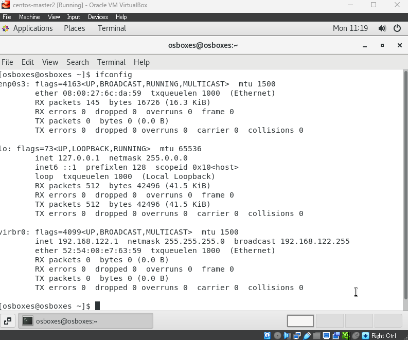
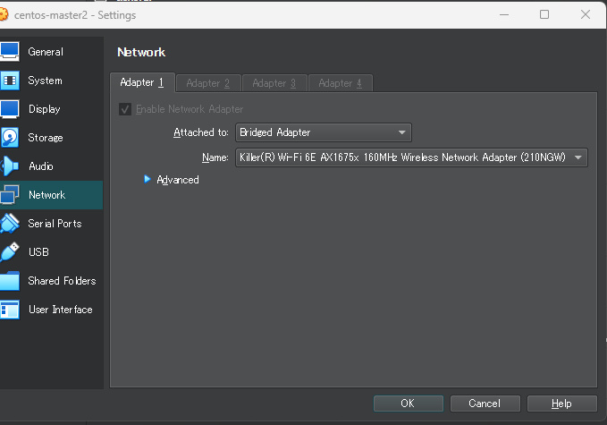
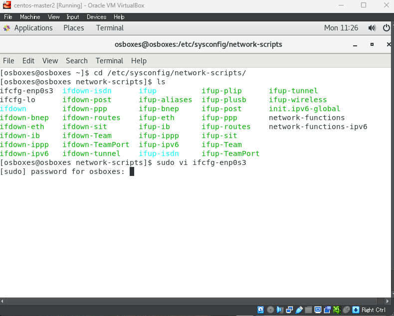
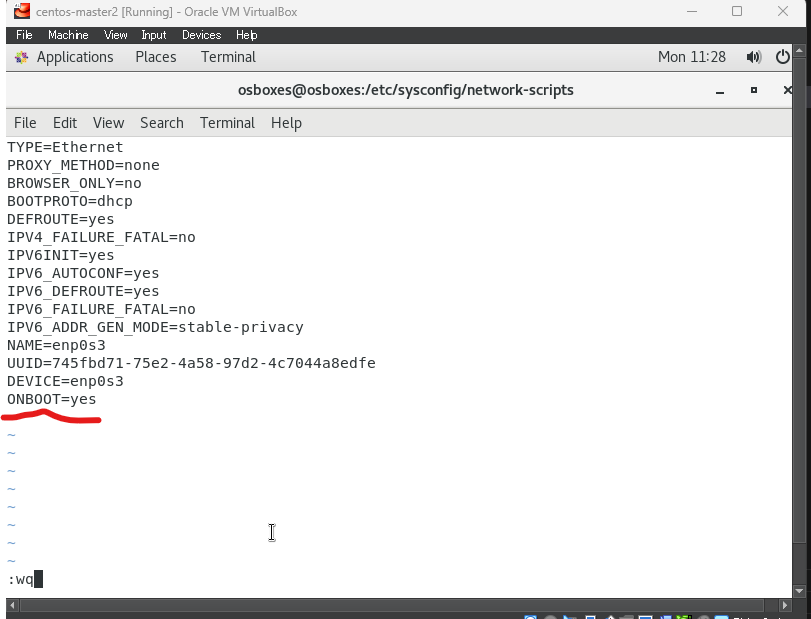
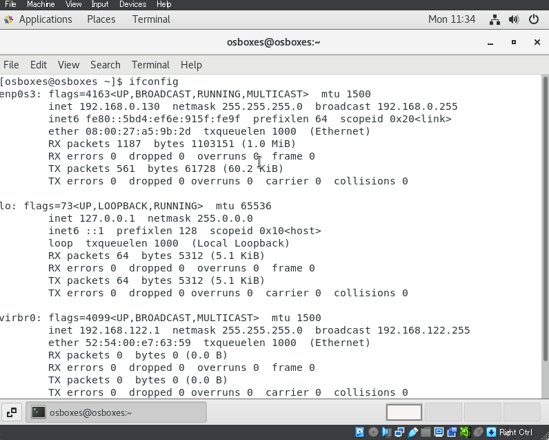

# 问题：IPV4 在选择桥连接之后任然不显示

## 执行的环境参考下面

|  version-vm  | version-os |
|  ----  | ----  |
|  VirtualBox-7.0.8-156879-Win | CentOS-7.9-2009_VB-64bit |







## 结局方案


```
$ cd /etc/sysconfig/network-scripts/ 进入目录
$ ls          # 显示所有的文件  
$ sudo vi enp0s3   #enp0s3 是你自己使用的桥连接的网卡号，我这边是enp0s3,所以才编辑这个文件
$ # 输入密码
.
.
.
# 将最后一行的ONBOOT后面的值改成yes
# 然后保存，重启虚拟机再次尝试ifconfig
# 因为后面有拷贝的动作，建议改template
```





